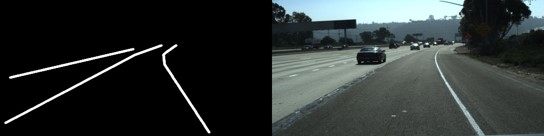
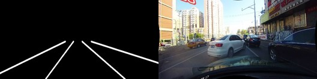
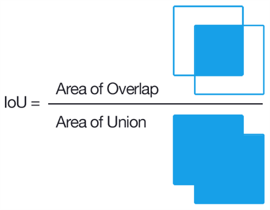
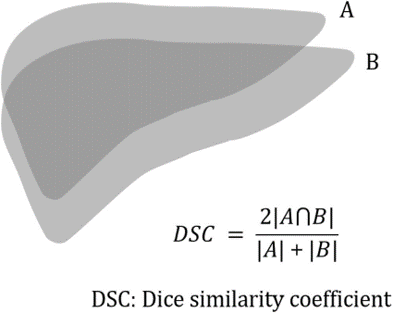
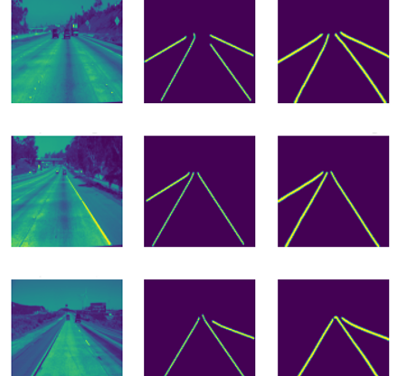
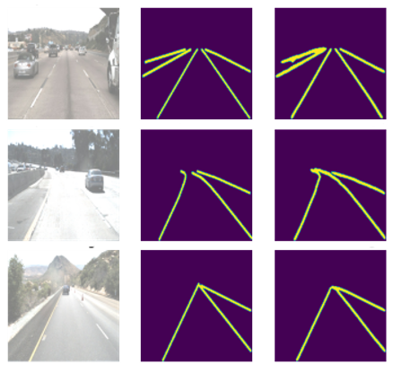

# Lane Detection Using U-net
This is lane detection model based on a U-net. This project is part of the thesis "Lane detection using neural networks", which was done in collaboration with:
 * _UAQ_ - Universidad Autonoma de Queretaro
 * _CIO_ - Centro de Investigacion en Optica (Campus León)
 * _CONACYT_ - Consejo Nacional de Ciencia y Tecnologia

## Overview

This repo has two main scripts _train_model_ and _test_model_. _train_model_ is for training the U-net neural network, you can choose different U-net models like: 
* Small U-net
* Medium U-net
* W-net
* U-net pp
* CIO-net: our proposed network

It also has different loss functions, they are in _models/loss_functions.py_ some of them are:
* Dice loss
* Focal loss
* Tversky loss
* Focal tversky
* Focal tversky + L1 (our proposed loss function)

## Datasets
The models where trained with the dataset [Tusimple](https://www.kaggle.com/datasets/manideep1108/tusimple) and [CUlane](https://xingangpan.github.io/projects/CULane.html).

Image samples:
<p align="center">
    
</p>

<p align="center">
    
</p>


## Metrics

The metrics used where Dice coefficent and IoU, the model uses this metrics for the general testing under _test_model.py_ the description of the metrics are:

<p align="center">
IoU 
</p>

<p align="center">
  
</p>

<p align="center">
Dice coefficient.
</p>
<p align="center">

</p>

### Tusimple metrics

It also has an implementation of the Tusimple official metrics under _TuSimple_testing_ in the file _TuSimple_test_ the usage for this is the following:

```python
python .//TuSimple_testing//Tusimple_test.py path_data path_pred save_path pred_json_path test_json_path
```

The documentation for the arguments are:

* img_size (int): Size of the images
* path_data (string): Label images path
* path_pred (string): Inference images from the model
* save_path (string): Where the processed images will be saved
* pred_json_path (string): Path where the json will be saved
* test_json_path (string): Path of the official tusimple jsons

## Usage

To train the selected model use:
```python
python train_model.py  train_img_path test_img_path output_model_path
```
where:
* train_img_path: Path to the training images
* test_img_path: Path to the test images
* output_model_path: Path where the model will be saved

To test the selected model use:
```python
python test_model.py  test_img_path save_path model_path
```
where:
* test_img_path: Path to the test images
* save_path: Path where the output images will be saved
* model_path: Path to the trained model

## Results

Some results of the test images can be seen below.

<p align="center">
1 channel image
</p>

<p align="center">
  
</p>

<p align="center">
3 channel image
</p>
<p align="center">

</p>

## Python env

The python version used was 3.9.17.